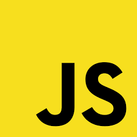

    
    

        
    

    
      
    <h2>Welcome to my GitHub</h2>

## 📑 About me
I'm software developer from Russia
+ Programming is my hobby and I know many programming languages, frameworks and tools.
+ Always ready and happy to learn something new, to improve myself.
+ Enough free time to improve skills and work.

## 🔧 Languages and Tools
 

